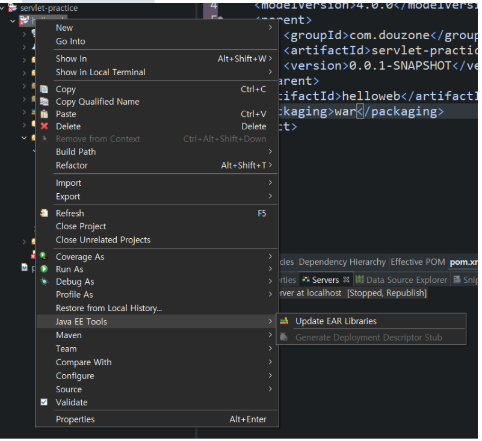
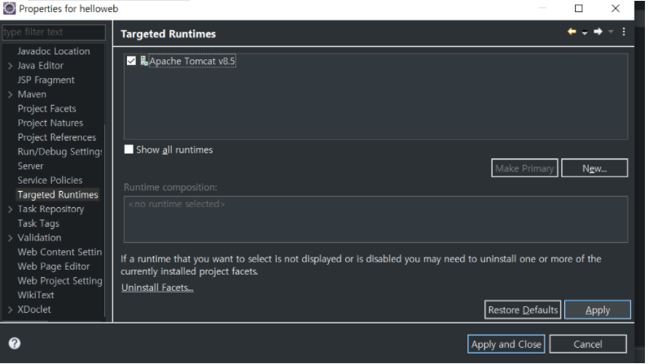

# servlet & JSP


## 서블릿

- <Strong>서블릿의 정의</Strong> : 클라이언트의 요청을 처리하고, 그 결과를 반환하는 Servlet 클래스의 구현 규칙을 지킨 자바 웹 프로그래밍 기술
- 네트워크에서 데이터를 전달받고(이 때 포트 번호를 통해 들어옴, ex) 8080), 그걸 Dao를 통해 DB로 전달하는  <span style="color:red">중간</span>에 서블릿이 들어감


- 클라이언트와 서블릿의 관계
  - httprequest랑 httpresponse로 주고받는다.


get / post 등으로 받는다.

- get : 어떠한 정보를 가져와서 조회하기 위해서 사용되는 방식
- post : 데이터를 서버로 제출하여 추가 또는 수정하기 위해서 사용하는 방식

http://localhost:8080/guestbook02/gb 이런 url로 접속


### Web Applications Server


## MVC 패턴


> - **Model:** 데이터를 가진 객체, 파라미터로 자주 쓰인다. DB의 테이블과 대응하는 경우가 많다.
> - **View:** UI를 담당한다. 클라이언트 측 기술인 Html, Css, Javascript등으로 만들어진 컨테이너이다.
> - **Controller:** UI를 통한 사용자의 입력 명령에 응답하고, 및 데이터 흐름 제어를 담당한다
>
> 
>
> => 모델1 보다는 모델2를 주로 사용


**모델1:**  JSP를 이용한 방식

**모델2:** servlet을 이용한 방식


## JSP


helloweb 프로젝트 생성후(war로 생성한다)

Java EE Tools - Generate Deployment Descriptor stub



JSP 파일을 생성한다. 생성이후 오류가 잡혀있는데, 톰캣 런타임 설정을 해줘야한다.


프로젝트 폴더에 properties


톰캣 체크 후 apply




이후 project-clean로 이동


자신의 프로젝트를 선택후 clean을 누른다.


hello.JSP의 런타임이 톰캣으로 설정되면서 오류가 사라진다. 


**어플리케이션 Add**

이클립스 하단의 Servers - 마우스 오른쪽 - Add


오른쪽으로 프로젝트를 add 한다


서버실행 : 오른쪽의 재생버튼 클릭


URL을 통해 브라우저에서 .jsp 확인


## JSP실습


##### form.jsp

```
<%@ page language="java" contentType="text/html; charset=UTF-8"
    pageEncoding="UTF-8"%>
<!DOCTYPE html>
<html>
<head>
<meta charset="UTF-8">
<title>Insert title here</title>
</head>
<body>
	<h1>회원가입</h1>
	<form action="join.jsp" method="post">
		이메일: <input type="text" name="email" value="@gmail.com"/>
		<br/><br/>
		비밀번호: <input type="password" name="password" value=""/>
		<br/><br/>
		
		<select name="birthYear">
			<option value="1994">1994년</option>
			<option value="1995">1995년</option>
			<option value="1996">1996년</option>
		</select>
		<br/><br/>
		성별:
		여 <input type="radio" name="gender" value="f"/>
		남 <input type="radio" name="gender" value="M" checked='checked'/>
		<br/><br/>
		
		취미:
		코딩 <input type="checkbox" name="hobby" value="coding"/>
		운동 <input type="checkbox" name="hobby" value="health"/>
		요리 <input type="checkbox" name="hobby" value="cooking"/>
		수영 <input type="checkbox" name="hobby" value="swimming"/>
		<br/>중복선택가능!
		<br/><br/>
		
		자기소개:
		<textarea name="profile">소개해봐라!
		</textarea>
		<br/><br/>
		
		
		<input type="submit" value="회원가입"/>
	</form>
</body>
</html>
```

> 버튼으로 넘어가는 페이지는 action="" 으로 명시할수 있다.
>
> checkbox타입은 여러개 선택가능, radio타입은 하나만 선택


##### join.jsp

```
<%@ page language="java" contentType="text/html; charset=UTF-8"
    pageEncoding="UTF-8"%>
    
<%
request.setCharacterEncoding("utf-8");

String email = request.getParameter("email");
String password = request.getParameter("password");
String birthYear = request.getParameter("birthYear");
String gender = request.getParameter("gender");
String[] hobbies = request.getParameterValues("hobby");
String profile = request.getParameter("profile");
%> <!-- 자바영역 -->
    
<!DOCTYPE html>
<html>
<head>
<meta charset="UTF-8">
<title>Insert title here</title>
</head>
<body>
	<%=email  %><br/>
	<%=password %><br/>
	<%=birthYear %><br/>
	<%=gender %><br/>
	
	<ul> 
	<%
		for(String hobby: hobbies){
	%>
		<li>
		<strong><%=hobby %></strong>
		</li>
	<%
		}
	%>
	</ul>
	
	<p>
	<%=profile.replaceAll("\n", "<br/>") %>
	</p>
	
	<br/><br/>
	<a href="form.jsp"> 폼으로가기</a>
	<a href="/helloweb/hello.jsp?name=양승우&email=ysw3114"> hello.jsp에 가기</a>
</body>
</html>
```

> a href -> 문서내 이동이 가능
>
> <%
> request.setCharacterEncoding("utf-8");
>
> String email = request.getParameter("email");
> String password = request.getParameter("password");
> String birthYear = request.getParameter("birthYear");
> String gender = request.getParameter("gender");
> String[] hobbies = request.getParameterValues("hobby");
> String profile = request.getParameter("profile");
> %>   // HTML문서내의 자바 영역
>
> 
>
> <a href="/helloweb/hello.jsp?name=양승우&email=ysw3114"> hello.jsp에 가기</a> -> 클릭시 작성한name값과 email 값이 hello.jsp페이지로 넘어간다.


##### hello.jsp에 가기를 눌렀을때 나오는 페이지


##### 서버 연동을 위해서는 프로젝트의 설정에서 런타임을 적용시켜줘야한다.


##### 초록색 재생버튼을 통해 서버를 실행할수 있고


##### Add and Remove 설정을 통해 불필요한 서버실행을 위해 필요한 프로젝트만 Add 및 Remove를 통해 관리한다.


### JSP 파일 인코딩

```sql
<%@ page language="java" contentType="text/html; charset=UTF-8"
    pageEncoding="UTF-8"%>
```

JSP파일은 상단에 위의 코드를 추가 해주어야 한다.

- **contentType의 charset** : Http Client(웹브라우저)가 받아볼 페이지의 인코딩 방식이다
- **pageEncoding** : JSP파일(페이지)에 기록된 소스코드 자체의 인코딩 방식이다


### web.xml

WEB-INF를 생성하기 위해 emaillist01 프로젝트를 우클릭 후 Java EE Tools - Generate Deployement Descriptor Stub 클릭한다

/src/main/webapp 밑에 WEB-INF 폴더가 생성되었는지 확인한다

```xml
xmlns="http://JAVA.sun.com/xml/ns/javaee"
```

web.xml 파일을 열어 xmlns의 java를 JAVA로 변경한다


##### jsp내의 자바 문법

1. **값받기**

> <%
>
>  String name =request.getParameter("name");
>
>  String email =request.getParameter("email");
>
> %>
>
> ​    


2. **view로 표현**

> <%=name %><br/>


3. **버튼**

>  <a href="/helloweb/hello.jsp?name=양승우&email=ysw3114"> hello.jsp에 가기</a>


4. **for문 사용**

> ​    
>
> 	<%
> 		for(GuestbookVo vo : list){ 
> 	%>
> 	<table width=510 border=1>
> 		<tr>
> 			<td><%=vo.getNo() %></td>
> 			<td><%=vo.getName() %></td>
> 			<td><%=vo.getReg_date() %></td>
> 			<td><a href="/guestbook02/gb?a=deleteform&no=<%=vo.getNo()%>">삭제</a></td>
> 		</tr>
> 		<tr>
> 			<td colspan=4><%=vo.getMessage() %></td>
> 		</tr>
> 	</table>
> 	<br>
> 	<%
> 		}
> 	%>
>
> ​    


