# 10.08

## 1. Emaillist project

### 패키지 생성

com.douzone.emaillist.dao 생성한다

com.douzone.emaillist.vo 생성한다


### emaillist01/pom.xml

```xml
-- emaillist01/pom.xml
<dependency>
	    <groupId>org.mariadb.jdbc</groupId>
	    <artifactId>mariadb-java-client</artifactId>
	    <version>2.7.2</version>
	</dependency>

	<build>
		<finalName>emaillist01</finalName>
		<plugins>
			<plugin>
				<groupId>org.codehaus.mojo</groupId>
				<artifactId>tomcat-maven-plugin</artifactId>
				<configuration>
					<url>http://127.0.0.1:8088/manager/text</url>
					<path>/emaillist01</path>
					<username>admin</username>
					<password>manager</password>
				</configuration>
			</plugin>		
		</plugins>
	</build>
```

mariadb 2.7.2 depencendy를 추가한다

- **<build>** : tomcat-maven 플러그인에서 url을 자신의 서버 주소와 포트번호로 수정한다
- **<path>** : /emaillist01로 바꾼다
- **<username>, <password>** : tomcat manager의 로그인 계정과 비밀번호로 변경해준다


### emaillistVo

EmaillistVo class 생성 및 변수 작성한다


### emaillistDao class 생성

- getConnection 메소드를 추가한다

- 연결 계정은 webdb

- insert 메소드 추가 및 수정한다

- findAll 메소드 추가 및 수정한다

  

### index.jsp

```java
<%@page import="java.util.List"%>
<%@page import="com.douzone.emaillist.dao.EmaillistDao"%>
<%@page import="com.douzone.emaillist.vo.EmaillistVo"%>

<% 
	EmaillistDao dao = new EmaillistDao();
	List<EmaillistVo> list = dao.findAll();
%>
```

Dao, Vo, List 클래스를 import해준 후  작성한다


```java
<%
		for(EmaillistVo vo : list) {
%>
<table> 태그 ...
</table> 태그 ...
<%
	 }
%>
```

table 태그를 for문으로 감싸주는 코드를 삽입한다


```java
<table> 태그 ...
	...
		<td><%=vo.getFistName() %></td>
		...
		<td><%=vo.getLastName() %></td>
		...
		<td><%=vo.getEmail() %></td>
	...
</table> 태그 ...
```

for문의 table 태그를 반복 작업하기 때문에 절대값(안대혁)을 넣는게 아니라 DB에서 가져온 list의 Vo에 담겨있는 데이터를 가져와야한다


### add.jsp

```java
// EmaillistDao, EmaillistVo import
<%@page import="com.douzone.emaillist.dao.EmaillistDao"%>
<%@page import="com.douzone.emaillist.vo.EmaillistVo"%>
```

 

```java
<%
	// 한글 데이터의 깨짐을 방지
	request.setCharacterEncoding("utf-8");

	String firstName = request.getParameter("fn");
	String lastName = request.getParameter("ln");
	String email = request.getParameter("email");

	EmaillistVo vo = new EmaillistVo();
	vo.setFirstName(firstName);
	vo.setLastName(lastName);
	vo.setEmail(email);
	
	new EmaillistDao().insert(vo);
%>
```

```java
<body>
	<h1>성공적으로 등록되었습니다.</h1>
</body>
```

body 태그 안에 h1 태그 삽입하여 테스트 해보자


### 브라우저에서 테스트

메일 가입 창에서 값을 입력하고 등록 버튼을 눌러 확인해보자

`성공적으로 등록되었습니다`가 뜬다

여기서 F5를 누르면 add.jsp가 다시 실행되어 반복적으로 데이터베이스에 저장되는 문제가 발생한다

이렇듯 insert, update, delete처럼  데이터베이스를 조작하는 동작이 있으면 응답을 Redirect 해주어야한다

```java
<%
	...
	new EmaillistDao().insert(vo);
	...
	response.sendRedirect("/emaillist01");
%>
```

바로 Redirect하기 때문에 밑의 html 코드들은 삭제해도 된다.

select문은 그냥 불러오기 때문에 상관없다


## 2. guestbook01 project

### WEB-INF

guestbook01 프로젝트 우클릭 - Java EE Tools - Generate Deployment Discriptor Stub 클릭


### pom

- dependency 추가하기

- build 추가하기

  - finalname 수정

  - path 수정

    

### update project

guestbook의 변경된 환경변수를 적용하기 위해 update 한다


### deleteform.jsp, index.jsp 추가

/src/main/webapp에 강의자료를 추가한다

html 형식을 jsp 파일로 수정한다

```java
<%@ page language="java" contentType="text/html; charset=UTF-8"
pageEncoding="UTF-8"%>
```

두 jsp 파일에 위의 코드 삽입한다


### 서버 타겟 런타임 등록

guestbook01의 properties - targeted runtime에서 tomcat 추가


### Server 탭

Tomcat의 add and remove에서 guestbook01추가한다

기존의 helloweb은 빼도 된다

Tomcat 서버 start


## Servlet 클래스 작성

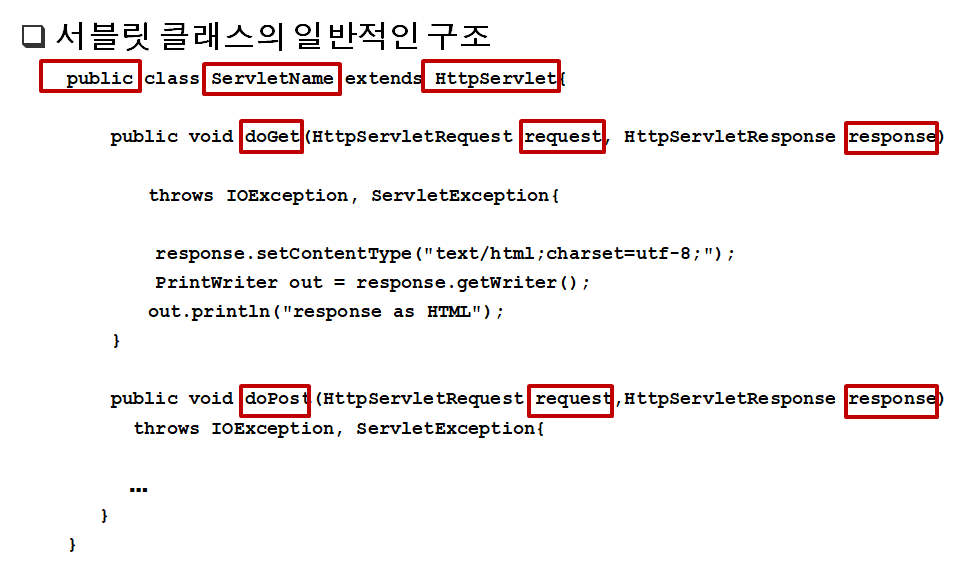


### 서블릿 작성 방법

**서블릿은 HttpServlet 클래스를 상속받는다. HttpServlet 클래스를 사용하기 위해서는 javax.servlet, javax.servlet.http, 그리고 java.io 패키지를 임포트 해야 한다.**

**HttpServlet 클래스의 doGet 메소드를 재정의(overriding)하고, GET 방식을 사용하는 모든 HTTP 
 요청을 처리한다.**

**HttpServlet 클래스의 doPost 메소드를 재정의(overriding)하고, POST 방식을 사용하는 모든 HTTP 
 요청을 처리한다.**

**doGet과 doPost 메소드는 웹 서버가 전달한 두 개의 객체를 인자로 받는다 : (1) HttpServletRequest 
 객체(*request* 객체*)*, 그리고 (2) HttpServletResponse 객체(*response* 객체*)***

**response 객체의 setContentType 메소드는 브라우저에 전달되는 응답의 콘텐트 타입(content type)을 설정한다. ** 

**response 객체의 getWriter 메소드는 브라우저에 HTML 코드를 보내는 PrinterWriter 객체를 리턴한다.**

**getWriter 메소드가 적절한 PrintWriter 객체를 리턴하기 위해서는, 반드시 PrintWriter 객체를 생성하기 전에 콘텐트 타입을 설정해야 한다. **


## 포워드 

- 서블릿에서 서블릿, 서블릿에서 JSP로 연동하는 방법

- 요청에 대한 추가 작업을 다른 서블릿에게 수행하게 한다

- 요청에 포함된 정보를 다른 서블릿이나 JSP와 공유할 수 있다

- 요청에 정보를 포함시켜 다른 서블릿에게 전달할 수 있다

- 모델2 개발시 서블릿에서 JSP로 데이터를 전달하는데 사용


### 포워드 종류

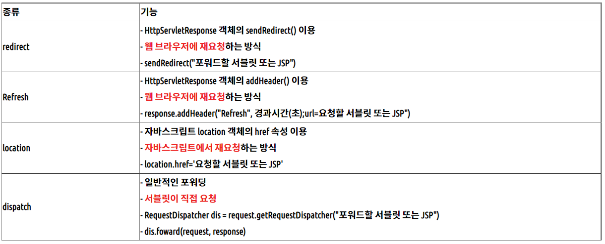


## **redirect, refresh, location**

**1. 웹 브라우저에서 FirstServlet 을 요청한다**

  **2. FirstServlet은 sendRedirect()를 통해 SecondServlet을 웹 브라우저에 재요청한다**

  **3. 웹 브라우저는 SecondServlet을 다시 요청한다**

  **※ 이때 1, 2번에서의 요청, 응답객체와 3번에서의 요청, 응답객체는 서로 다르다!**

​    **(dispatch.forward 방식과 차이가 되는 특징이다)**


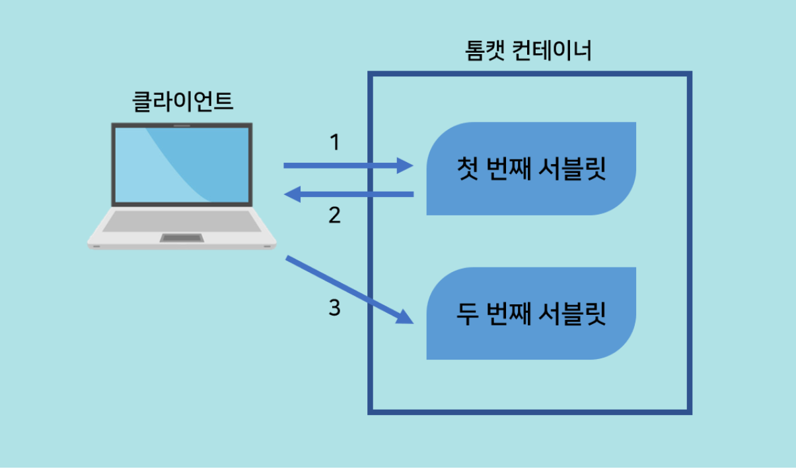

 **- redirect 방식으로 다른 서블릿에 데이터 전달하는 방법(GET 방식)**

​    **response.sendRedirect("second?name=park");**


##  **dispatch**

 **1. 웹 브라우저에서 FirstServlet을 요청한다**

  **2. FirstServlet은 RequestDispatcher를 이용해 SecondServlet으로 포워드한다**

  **※ 이때 1번에서 생성한 요청, 응답 객체를 2번에서 넘겨준다**

​    **(1번과 2번 응답, 요청 객체가 서로 같다는 점에서 redirect 방식과 차이를 갖는다)**

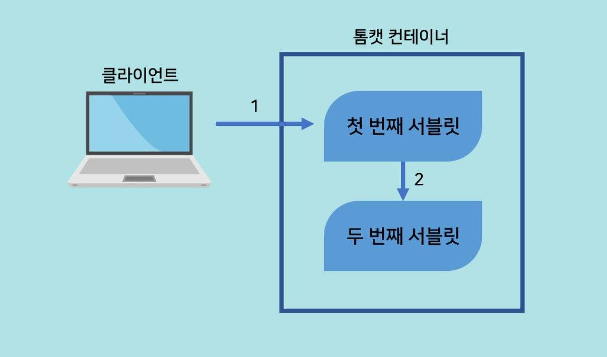


## web.xml 세팅

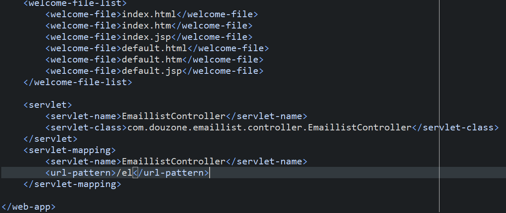

**url pattern은 여러개 매핑가능**

만들어둔 서블릿 등록과 서블릿 매핑을 해야됨 그후 주소뒤에 /el을 붙여야 매핑성공


-------------------------------------------------------------------------

#### 서블릿 파일 생성

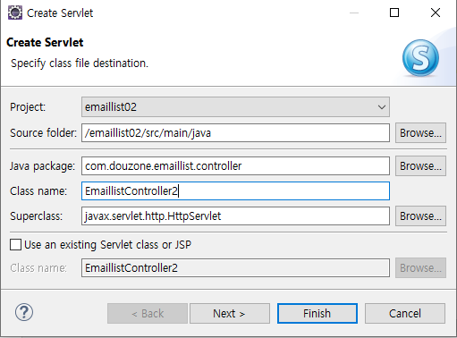

#### 매핑 명칭은 사용자 임의로 설정

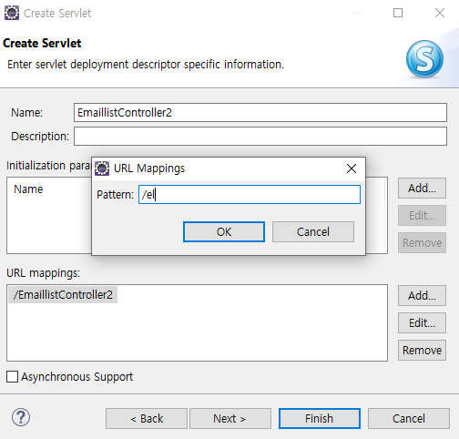

#### 생성

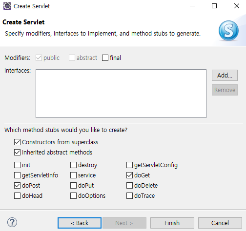

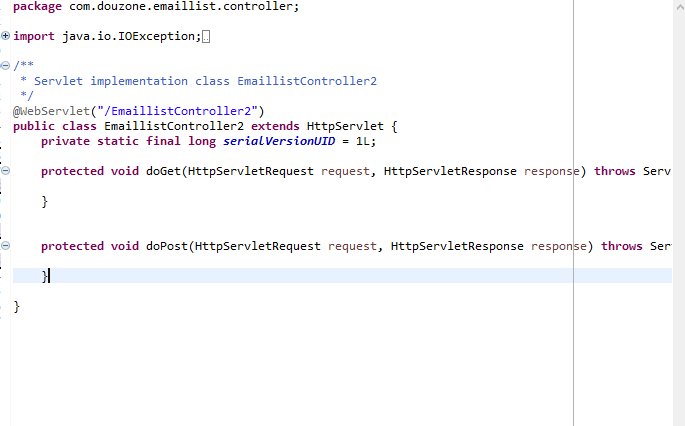


생성한 파일

####  com.douzone.emaillist.controller/EmaillistController.java

```
package com.douzone.emaillist.controller;

import java.io.IOException;
import java.util.List;

import javax.servlet.RequestDispatcher;
import javax.servlet.ServletException;
import javax.servlet.annotation.WebServlet;
import javax.servlet.http.HttpServlet;
import javax.servlet.http.HttpServletRequest;
import javax.servlet.http.HttpServletResponse;

import com.douzone.emaillist.dao.EmaillistDao;
import com.douzone.emaillist.vo.EmaillistVo;


public class EmaillistController extends HttpServlet {
	private static final long serialVersionUID = 1L;

	protected void doGet(HttpServletRequest request, HttpServletResponse response) throws ServletException, IOException {
		request.setCharacterEncoding("utf-8");
		String action = request.getParameter("a");
		
		if("form".equals(action)) {
			
			RequestDispatcher rd = request.getRequestDispatcher("/WEB-INF/views/form.jsp");
			rd.forward(request, response);
			
		}else if("add".equals(action)){
			
			String firstName = request.getParameter("fn");
			String laseName = request.getParameter("ln");
			String email = request.getParameter("email");
			
			EmaillistVo vo = new EmaillistVo();
			vo.setFirstName(firstName);
			vo.setLastName(laseName);
			vo.setEmail(email);
			
			new EmaillistDao().insert(vo); 
			
			response.sendRedirect("/emaillist02/el"); 
			
			
		}else { // "/emaillist02/el" url이 들어왔을때 실행되는 조건문
			EmaillistDao dao = new EmaillistDao();
			List<EmaillistVo> list = dao.findAll();
			
			request.setAttribute("list", list);
			
			RequestDispatcher rd = request.getRequestDispatcher("/WEB-INF/views/index.jsp");
			rd.forward(request, response);
		}
	}


	protected void doPost(HttpServletRequest request, HttpServletResponse response) throws ServletException, IOException {

		doGet(request, response);
	}

}

```


##### webapp/WEB-INF/views/form.jsp

```
<%@ page language="java" contentType="text/html; charset=UTF-8"
    pageEncoding="UTF-8"%>
<!DOCTYPE html>
<html>
<head>
<meta http-equiv="Content-Type" content="text/html; charset=UTF-8">
<title>Insert title here</title>
</head>
<body>
	<h1>메일 리스트 가입</h1>
	<p>
		메일 리스트에 가입하려면,<br>
		아래 항목을 기입하고 submit 버튼을 클릭하세요.
	</p>
	<form action="/emaillist02/el" method="post">
		<input type='hidden' name="a" value="add">
	    First name: <input type="text" name="fn" value="" ><br>
	    Last name: <input type="text" name="ln" value=""><br>
	    Email address: <input type="text" name="email" value=""><br>
	    <input type="submit" value="등록">
	</form>
	<br>
	<p>
	<a href="/emaillist02/el">리스트 바로가기</a>
	
	</p>
</body>
</html>
```

##### webapp/WEB-INF/views/form.jsp, index.jsp 

```
<%@ page import="java.util.List"%>
<%@ page import="com.douzone.emaillist.dao.EmaillistDao"%>
<%@ page import="com.douzone.emaillist.vo.EmaillistVo"%>
<%@ page language="java" contentType="text/html; charset=UTF-8" pageEncoding="UTF-8"%>
<%
	List<EmaillistVo> list = (List<EmaillistVo>)request.getAttribute("list");
%>
<html>
<head>
<meta http-equiv="Content-Type" content="text/html; charset=UTF-8">
<title>Insert title here</title>
</head>
<body>
	<h1>메일 리스트에 가입되었습니다.</h1>
	<p>입력한 정보 내역입니다.</p>
	<!-- 메일정보 리스트 -->
	<%
		for(EmaillistVo vo : list) {
	%>
		<table border="1" cellpadding="5" cellspacing="2">
			<tr>
				<td align=right>First name: </td>
				<td><%=vo.getFirstName() %></td>
			</tr>
			<tr>
				<td align=right width="110">Last name: </td>
				<td width="110"><%=vo.getLastName() %></td>
			</tr>
			<tr>
				<td align=right>Email address: </td>
				<td><%=vo.getEmail() %></td>
			</tr>
		</table>
		<br>
	<%
		}
	%>
	<p>
		<a href="/emaillist02/el?a=form">추가메일 등록</a>
	</p>
	<br>
</body>
</html>
```


##### EmaillistController.java(서블릿) 소스의 내부 작동원리

>  브라우저로 http://localhost:8080/emaillist02/el 접속시 아래 조건실행

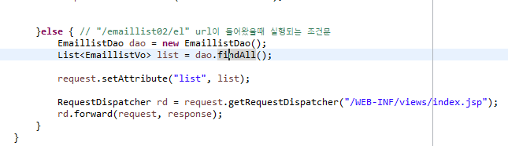


>  RequestDispatcher 작동원리

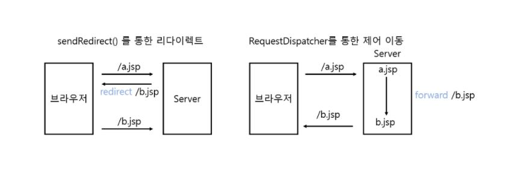

 

>  url  http://localhost:8080/emaillist02/el?a=form 값이 넘어올경우

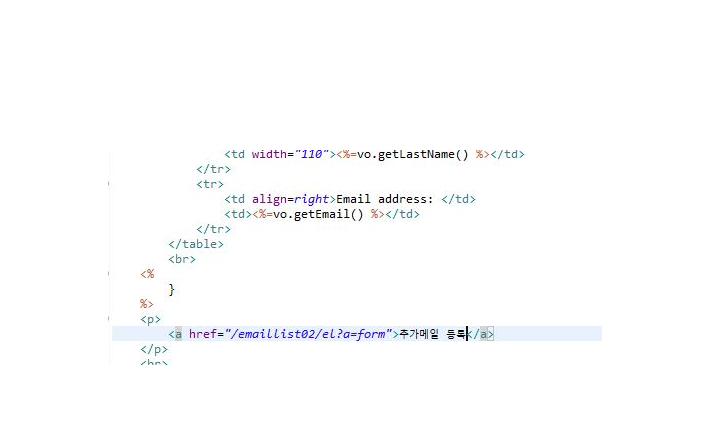


>  url  http://localhost:8080/emaillist02/el?a=form 값이 넘어올경우

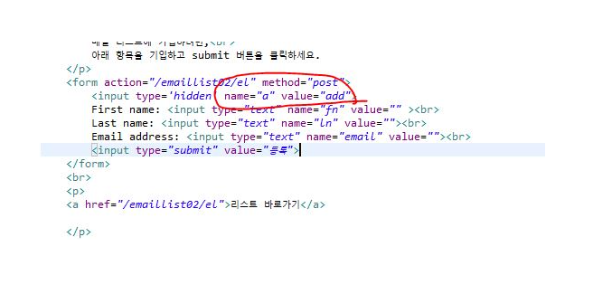  

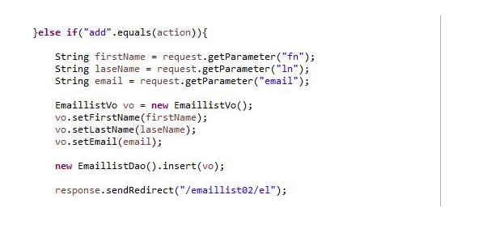

